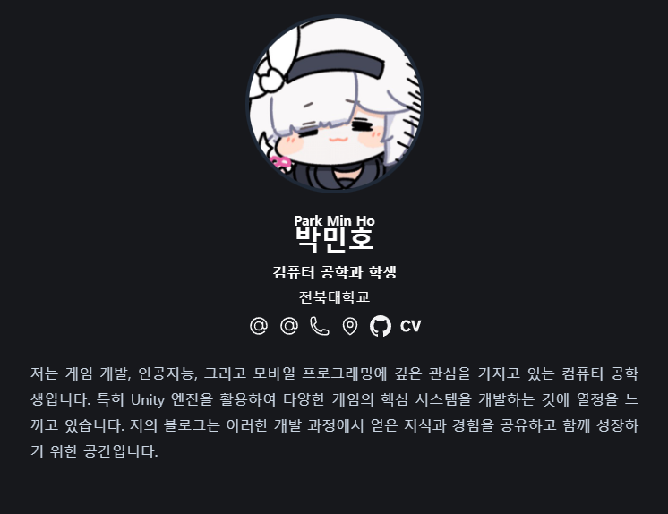

# 박민호 개인 포트폴리오 (MiLLku's Portfolio)

안녕하세요! 게임 개발, AI, 그리고 모바일 프로그래밍에 대한 저의 프로젝트와 기술 스택을 담은 박민호의 개인 포트폴리오 홈페이지입니다.

이 홈페이지는 Hugo Blox 프레임워크를 기반으로 제작되었으며, 저의 개발 역량과 프로젝트 경험을 시각적으로 보여주기 위해 만들어졌습니다.

## 포트폴리오 주요 내용

이 홈페이지에서는 다음과 같은 저의 프로젝트들을 확인하실 수 있습니다.

-   **Unity 게임 시스템 개발:** C#을 활용하여 게임의 핵심 시스템을 개발한 프로젝트 경험을 상세히 다룹니다.
-   **기술 블로그:** 각 프로젝트를 진행하며 얻은 기술적인 지식과 문제 해결 과정을 기록한 포스트들을 포함합니다.
-   **개인 프로필:** 저의 관심사와 기술 스택, 그리고 학력 사항 등을 소개합니다.

## 둘러보기

-   **포트폴리오 바로가기:** [https://millku.github.io/](https://millku.github.io/)
-   **GitHub 프로필:** [https://github.com/MiLLku](https://github.com/MiLLku)